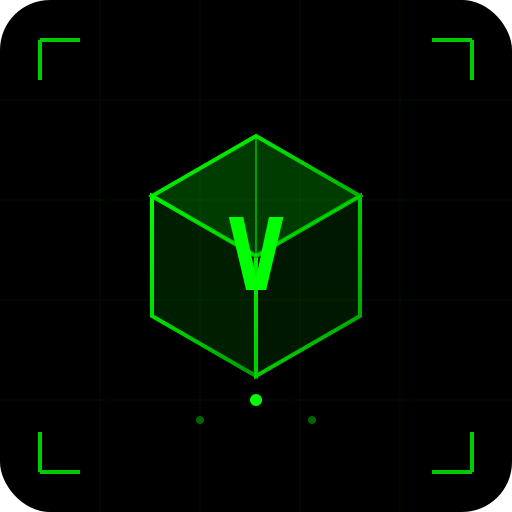

# VoxelScript 🟢

<p align="center">
  
</p>

<p align="center">
  <strong>The Matrix Programming Language</strong><br>
  A simple, powerful language with 3D code visualization
</p>

<p align="center">
  <a href="#-quick-install">Quick Install</a> •
  <a href="#-features">Features</a> •
  <a href="#-quick-start">Quick Start</a> •
  <a href="#-3d-editor">3D Editor</a> •
  <a href="#-vs-code-extension">VS Code</a>
</p>

---

## 🚀 Quick Install

### Windows
```powershell
git clone https://github.com/YOUR_USERNAME/voxelscript.git
cd voxelscript/voxel-lang
.\install-windows.bat
```

### macOS / Linux
```bash
git clone https://github.com/YOUR_USERNAME/voxelscript.git
cd voxelscript/voxel-lang
chmod +x install.sh && ./install.sh
```

### npm
```bash
npm install -g voxelscript
```

**After installation:**
- ✅ Type `voxel` in any terminal
- ✅ Double-click `.voxel` files to run them
- ✅ Right-click → "Run Script" on `.voxel` files

---

## ✨ Features

| Feature | Description |
|---------|-------------|
| 🎯 **Simple Syntax** | Easy to learn, powerful to use |
| 🖥️ **3D Code Editor** | Watch your code float in 3D space |
| 🌙 **Matrix Theme** | Pure black with neon green |
| 🚀 **200+ Built-ins** | Math, strings, arrays, files, HTTP |
| 💻 **Cross-Platform** | Windows, macOS, Linux |
| 📦 **VS Code Extension** | Syntax highlighting & IntelliSense |

---

## 📝 Quick Start

```bash
# Start REPL
voxel

# Run a file
voxel hello.voxel

# Run code directly
voxel -e "print 'Hello, Matrix!'"
```

### Example Code

```voxel
// Variables
let name = "Neo"
let numbers = [1, 2, 3, 4, 5]

// Functions
fn greet(person) {
    print "Hello, " + person + "!"
}

greet(name)

// Loops
for i in range(0, 5) {
    print i
}

// Array operations
let doubled = map(numbers, (x) => x * 2)
print doubled  // [2, 4, 6, 8, 10]
```

---

## 🖥️ 3D Editor

VoxelScript includes a unique 3D code editor!

```bash
cd voxel-lang/editor
npm install
npm start
```

<p align="center">
  <em>Code lines as floating 3D cubes • Matrix rain • Particle effects</em>
</p>

---

## 🎨 VS Code Extension

```bash
cd voxelscript-vscode
npm install
npx vsce package
# Install the .vsix in VS Code
```

Features: Syntax highlighting • Snippets • Run with F5 • Matrix theme

---

## 📁 Project Structure

```
voxelscript/
├── voxel-lang/              # Core language
│   ├── voxel.js             # CLI & interpreter
│   ├── lexer.js             # Tokenizer
│   ├── parser.js            # AST parser
│   ├── interpreter.js       # Executor (200+ built-ins)
│   ├── install.sh           # Linux/macOS installer
│   ├── install-windows.bat  # Windows installer
│   ├── examples/            # Example programs
│   └── editor/              # 3D Electron editor
└── voxelscript-vscode/      # VS Code extension
```

---

## 📄 License

MIT License - see [LICENSE](voxel-lang/LICENSE)

---

<p align="center">
  <strong>Welcome to the Matrix! 🟢</strong>
</p>
